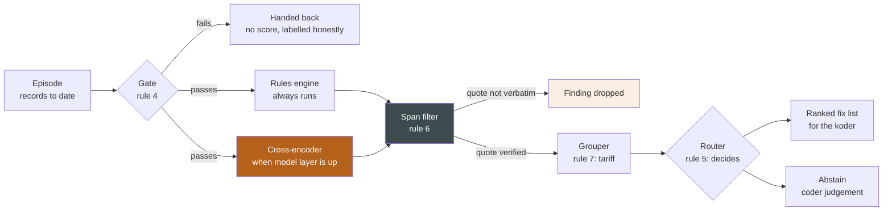
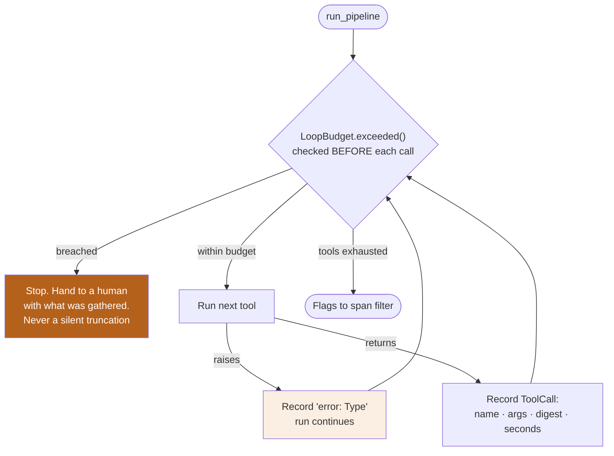
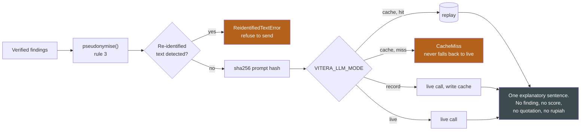
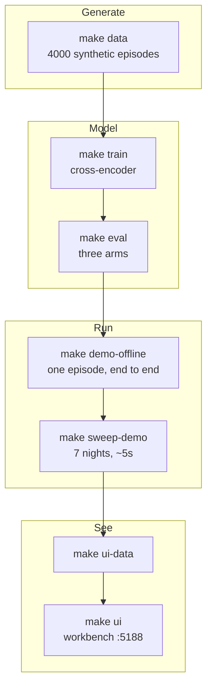
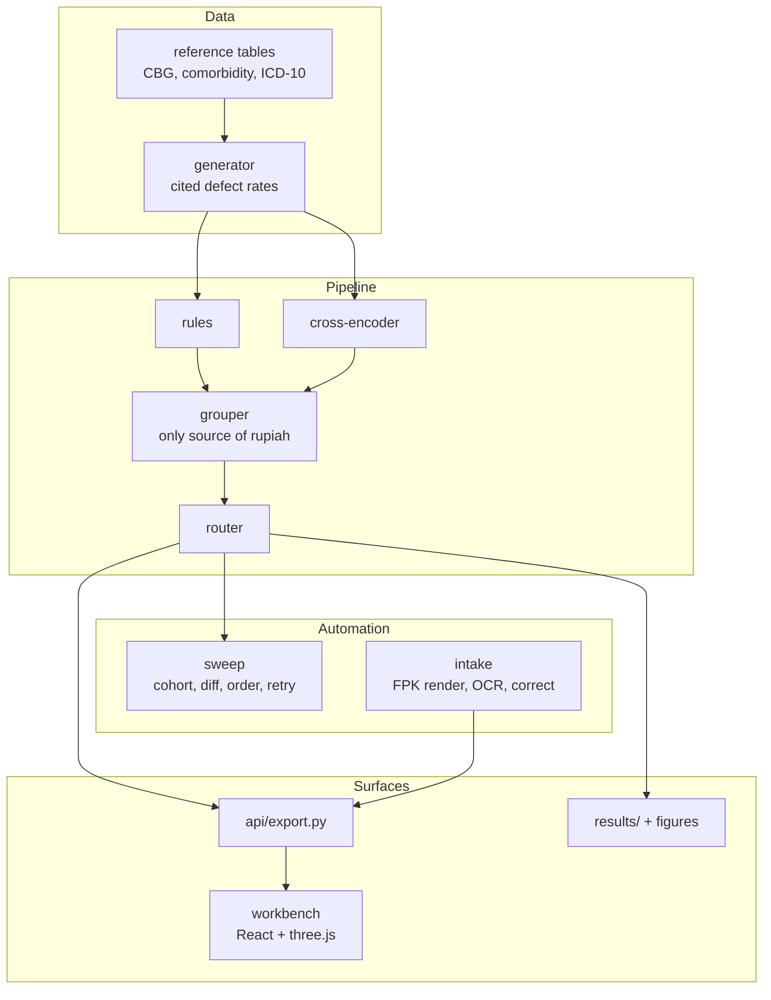

# Vitera

**Concurrent BPJS claim verification for Indonesian hospital inpatient episodes.**

> We red-team the claim before BPJS does, while there is still time to fix it.

An agent verifies a BPJS claim against the inpatient episode **continuously, while
the patient is still admitted**. It finds what would cause the claim to be pended,
and hands the medical coder (*petugas casemix / koder klinis*) a ranked fix list
with evidence quoted from the patient record.

Every claim in this README is either measured and reproducible from this repository,
or cited to a published study. All data here is **synthetic** — see
[Data and honesty](#data-and-honesty).

---

## The problem: two gaps, not one

Closing either one alone closes nothing.

| Gap | What it is | Source |
|---|---|---|
| **Coverage** | Inpatient claims pend at **12–17%** — and pending is only the visible tip. Observed defect prevalence runs far higher, so most defects never pend at all: they are absorbed silently as underpayment. | Maulida & Djunawan 2022 (12.2%, n=720); Dewi & Wirajaya 2024 (16.7%, n=779) |
| **Timing** | In **68.6%** of inpatient episodes, a secondary diagnosis present in the medical record never carried into the discharge summary. Whatever review exists happens *after* discharge, when a supporting test can no longer be ordered and the DPJP is reconstructing from memory. | Opitasari & Nurwahyuni 2018, HSJI 9(1):14–18, Table 2 (n=105) |

Undercoding outnumbers overcoding roughly **2:1** (13.3% vs 6.7%), and the net
revenue difference at that site was **~4%** of submitted claim value.
Every rate used by the generator traces to a graded row in
[`docs/LITERATURE.md`](docs/LITERATURE.md); an uncited rate fails `make data`.

---

## How it works

The same `run_pipeline` runs once per episode per night. Nothing else changes
between a mid-stay check and a discharge check — concurrent monitoring *is* the
discharge pipeline invoked N times.



Four properties of that diagram are load-bearing:

- **The gate runs before anything else.** An illegible sheet or a failed total is
  handed back, not guessed at.
- **Detection is rules + cross-encoder only.** The language model writes the
  explanatory sentence and nothing else. Turning it off changes no finding, score,
  quotation or tariff — measured at **0 LLM calls** across the demo cohort.
- **A finding without a verbatim quote is dropped**, not softened. The browser
  re-verifies every span against the document text a second time before rendering.
- **Only the grouper produces rupiah.** No model ever emits a monetary figure.

### Why concurrent beats at-discharge

```
                day 0        day 3        day 6   discharge      +weeks
                  |            |            |         |             |
signal visible    ●━━━━━━━━━━━━━━━━━━━━━━━━━━━━━━━━━━━●
in labs/meds/CPPT      the diagnosis is inferable from here on

documented in                                        ◐  ← or never: 68.6%
resume medis                                            of episodes

Vitera            ●━━━━━━━━━━━━━━━━━━━━━━━━━━━━━━━━━━━●
                  nightly check, DPJP still on the ward,
                  supporting test still orderable

conventional                                          ╳━━━━━━━━━━━━●
review                                                 nothing fixable:
                                                       patient is home
```

The window between *signal* and *documentation* is where Vitera operates. After
discharge, a QUERY to the DPJP is no longer answerable from the ward.

---

## The agent harness

The agent is not a free-running loop. It is a **bounded runner** with an audited
trace and a hard boundary in front of the model. Three failure modes are designed
out rather than monitored for: an agent that runs away, an agent that dies on one
bad tool, and an agent that leaks a patient record to a vendor.



| Bound | Default | On breach |
|---|---|---|
| `max_tool_calls` | 8 | named in the trace, run stops, findings so far are kept |
| `max_reflections` | 1 | same |
| `wall_clock_seconds` | 20.0 | same |

The budget is checked *before* each call, so a breach never leaves a half-finished
tool result in the trace. A tool that throws is caught, recorded as an error, and
the run continues — one broken check cannot take down the episode.

### The model boundary

`agent/boundary.py` holds the only component in the package that talks to a model.



- **Pseudonymisation is enforced, not documented.** Sending re-identified text
  raises rather than warns.
- **`cache` mode never falls back to a live call.** A demo cannot silently become
  a network call on stage; a missing entry is a loud `CacheMiss`.
- **`NullLLMClient` is a first-class mode.** With no model at all the pipeline
  still runs, the result is marked `advisory`, and the unchecked classes are named.

Every field in the diagram above is visible per episode in the workbench under
**Jejak pemeriksaan**, and per run in `results/`.

---

## What is measured

Held-out split: **1,332 episodes, 10,626 pipeline runs**, hospital-level holdout
(class D hospitals appear only in test). Source: `results/detection_curve.json`.

| Metric | Value |
|---|---|
| Defects detected before discharge | **86.65%** |
| Median lead time | **5 days** |
| Findings with a ≥2-day repair window | **86.08%** |
| Clean claims flagged, at discharge | **3.71%** |
| Clean claims flagged, early in stay | **36.88%** |
| Latency | **18.3 ms/run** (Apple silicon, local) |
| LLM calls | **0** |

Detection rises across the stay rather than falling — the count of *new* findings
per day is what "concurrent" means:

```
share of stay   detection rate
0%    ██████████████████████████░░░░░░░░░░░░░  63.9%
20%   ████████████████████████████░░░░░░░░░░░  70.5%
40%   ████████████████████████████████░░░░░░░  79.3%
60%   ██████████████████████████████████░░░░░  84.2%
100%  ███████████████████████████████████░░░░  86.7%
```

**Both false-positive numbers are always reported together.** 3.71% at discharge
alone would misrepresent a product that runs nightly, where the rate is 36.88%.
The `high_precision` threshold set trades to 2.0% per-code false positives at
98.5% recall — one value in `thresholds.yaml`, not new work.

### Reported defects

Honesty is a feature here, so failures ship on the screen:

- **`flag_churn_rate` breaches its own ceiling: 0.214 against 0.15.** Shown in the
  UI, in `results/`, and here. It is an upper bound — a D3/D5 that resolves because
  a narrative or lab result arrived is not matched by code, so it counts as
  unexplained. `make sweep` exits non-zero on a breach.
- **Rules alone reach 3 of 8 defect classes** (D1, D6, D8). That gap is the
  argument for the cross-encoder, and it is measured, not asserted.

---

## Quickstart

```bash
make setup          # editable install + dev deps
make test           # contract tests
make demo-offline   # end-to-end run, replayed from cache
make ui             # workbench on :5188, static and offline
```

Python 3.11+. Training runs on Apple silicon via MPS.



### Commands

| Target | Does |
|---|---|
| `make data` | Generate the frozen synthetic dataset |
| `make leakage` | Text-only leakage check |
| `make train` | Fine-tune the cross-encoder |
| `make baselines` | Cross-encoder vs. BM25 vs. zero-shot LLM, per class |
| `make detection` | Detection lead time, rate-by-day, fairness strata |
| `make arm-a` | Rules-only baseline |
| `make eval` | Three-arm experiment across seeds |
| `make demo` / `make demo-offline` | End-to-end discharge path, live / replayed |
| `make sweep` / `make sweep-demo` | One night / 7 replayed nights |
| `make fpk` / `make intake` / `make intake-eval` | Render FPK forms, read a scan back, measure OCR |
| `make ui-data` / `make ui-build` / `make ui` | Export payload, build, serve the workbench |
| `make ui-check` | Render the dashboard against degraded payloads |
| `make figures` | Regenerate every paper figure |
| `make freeze-check` | Verify the sealed adversarial set is untouched |

`VITERA_LLM_MODE` = `live` | `record` | `cache`. Rehearse in `record` to populate
the cache `demo-offline` replays. Never demo by waiting for a clock.
`VITERA_OCR_MODE` = `auto` | `cache`; `make intake` defaults to `cache` and reads
the committed sample scan, so it runs with no OCR engine installed.

---

## Architecture



The **sweep** is deliberately the dumbest component: select a cohort, call the
existing `run_pipeline` per episode, diff against that episode's last successful
run, order, retry. No inference lives there and nothing leaves the system — there
is no transport imported anywhere in the package, and a test asserts it by parsing
imports rather than trusting prose. The queue is a **diff, not a standing list**:
re-presenting yesterday's findings every morning is how a monitoring product gets
switched off in week two.

The **workbench** renders pipeline output and computes nothing. Its one exception
is a re-check, not a computation: spans are verified against document text in the
browser before a flag renders. There is no per-coder cut anywhere on the unit
dashboard, and there will not be one — a queue that doubles as a productivity
monitor is a queue whose findings get closed rather than fixed.

### Layout

```
config/       defects.yaml (a citation per rate) · sites.yaml · thresholds.yaml · sweep.yaml
data/         reference/ · generated/ (+ seeds, LLM/OCR cache) · intake/ · adversarial/ (SEALED)
src/vitera/   contracts · config · generator · rules · grouper · models · agent · sweep · intake · api · ui
experiments/  arm_a · arm_b · arm_c · ablations · leakage_check
results/      committed figures + metrics JSON
docs/         DATA_CARD · MODEL_CARD · CLAIMS · LITERATURE
tests/        contract tests, import-boundary test, generator invariants
```

---

## Data and honesty

**Everything in this repository is synthetic.** No real patient data was used,
seen, or approximated from a real record. 4,000 episodes generated from published
aggregate statistics — see [`docs/DATA_CARD.md`](docs/DATA_CARD.md).

Two things a reader should check before quoting anything:

1. **`domain_verified: false`.** Every INA-CBG code, ICD-10 code, severity weight,
   LOS range and **every rupiah tariff** in `data/reference/*.yaml` is a plausible
   placeholder written without access to a real INA-CBG tariff table. The generator
   warns on every run and stamps the flag into the manifest. **No rupiah figure from
   this corpus may be quoted as a magnitude.** The UI says so beside every one.
2. **`docs/CLAIMS.md` is the register.** If a sentence is not in that file, it does
   not go on a slide. It lists what we may state, what we may not, and the exact
   phrasings that are forbidden — including claims we found we could *not* support
   and removed.

Timing is sampled by our own generator, so `detection_lead_time` is always
reported *under stated generator assumptions*. Holdout is hospital-level, but the
hospitals are synthetic too, so external validity is untested.

---

## Limitations

- No validation by a practising coder, and no real BPJS pend-reason taxonomy; the
  eight defect classes are constructed from study categories, not the payer's codes.
- No published Indonesian data exists on the gap between clinical signal and
  documentation, so that interval is an explicit modelling assumption.
- The cross-encoder is one checkpoint, so training-seed variance is not measured.
- Writing a committed correction back to the hospital's claim of record is not
  built. The workbench records commits as a durable, exportable **draft** and says
  plainly that it is not a submission — the agent drafts and stages, a human commits.

## License

To be released with the paper.
